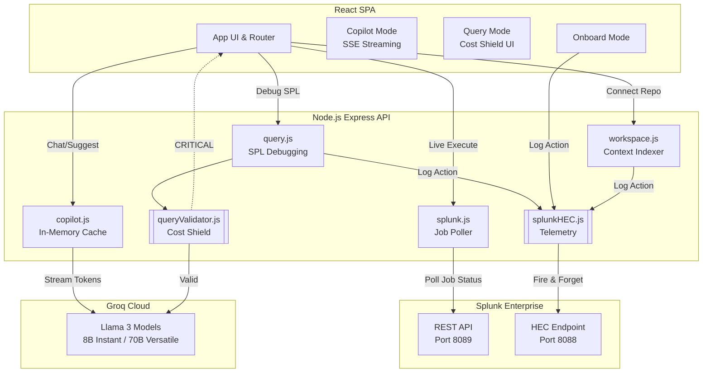

# Splunk Co>Dev 🧑‍💻🔥

> **An intelligent, context-aware developer companion for Splunk.**
> Built for the Splunk Hackathon 2026.

Splunk Co>Dev is a full-stack, hyper-optimized developer environment that bridges the gap between raw SPL writing and the power of modern LLMs. It is not just a chat wrapper; it is a **closed-loop system** that executes queries, actively shields Splunk from expensive typos, indexes your local workspace, and logs its own telemetry back into Splunk.


## 🚀 Key Differentiators (Why This Wins)

1. **Proactive Cost Shield (Deterministic Guardrails)**
   Instead of relying on an LLM to guess if a query is bad, Co>Dev runs a static `queryValidator` *before* hitting Splunk or the AI. It instantly blocks `CRITICAL` queries (like `index=*` without constraints), saving API costs and protecting the Splunk deployment from crippling wildcard searches.
   
2. **Hyper-Optimized Streaming Copilot**
   Powered by `llama-3.1-8b-instant` and Server-Sent Events (SSE). It features an in-memory session/workspace cache, resulting in a chat UI that feels as fast as a native app (first token in ~200ms) with zero disk I/O per request.

3. **Workspace Context Indexer**
   Co>Dev isn't blind. Point it at a local project folder, and it recursively scans for logging patterns (`winston`, `console.log`, `sourcetype`). It injects your actual codebase into the Copilot's prompt, making the AI's suggestions explicitly relevant to your current code.

4. **Closed-Loop Telemetry (HEC Integration)**
   Every action you take in Co>Dev—analyzing a query, onboarding a log, running a search—is asynchronously fired back to Splunk via the HTTP Event Collector (HEC). Co>Dev monitors itself.

5. **Live Performance Analyzer**
   It doesn't just show search results. It extracts the raw job manifest (scan counts, run duration, drop counts) and runs a deterministic efficiency algorithm to score your query's performance, providing actionable SPL tuning advice.

---

## 🛠️ System Architecture



---

## 💻 Getting Started

### Prerequisites
- Node.js (v18+)
- Splunk Enterprise (Running locally or Cloud)
- Groq API Key

### 1. Backend Setup
```bash
cd backend
npm install
cp .env.example .env
# Edit .env with your Splunk credentials and Groq API key
npm start
```

### 2. Frontend Setup
```bash
cd frontend
npm install
npm start
```

*The app will automatically open at `http://localhost:3000`.*

---

## 🧠 The "Closed-Loop" Demo Flow

To see the true power of Co>Dev, follow this flow:
1. **Connect Workspace**: Click "Connect Workspace" in the sidebar and point it to the backend folder.
2. **Trigger the Shield**: Go to "Debug SPL" and type `index=*`. Watch the Cost Shield instantly block you.
3. **Fix and Execute**: Fix the query to `index=_internal | head 10` and run it live.
4. **Analyze**: View the Performance Analyzer score calculated from the Splunk job metrics.
5. **Ask Copilot**: Open the Copilot and ask, "Based on my session, what should I build next?" Watch it instantly stream context-aware advice using your workspace data.
