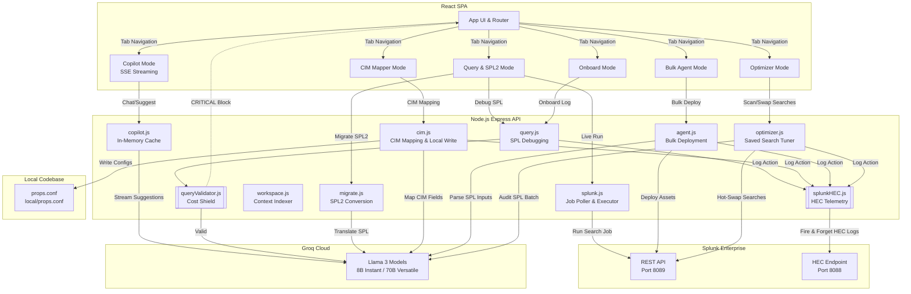

# Splunk Co>Dev 🧑‍💻🔥

> **An intelligent, context-aware developer companion for Splunk.**
> Built for the Splunk Hackathon 2026.

Splunk Co>Dev is a full-stack, hyper-optimized developer environment that bridges the gap between raw SPL writing and the power of modern LLMs. It is a **closed-loop system** that executes queries, actively shields Splunk from expensive queries, indexes local workspaces, maps log parameters to compliant CIM structures with local write-backs, auto-deploys dashboard/alert assets in bulk, and monitors itself via Splunk telemetry.


---

## 🚀 Key Differentiators & Features

1. **Proactive Cost Shield (Deterministic Guardrails)**
   Instead of relying on an LLM to guess if a query is bad, Co>Dev runs a static `queryValidator` *before* hitting Splunk or the AI. It instantly blocks `CRITICAL` queries (like `index=*` without constraints), saving API costs and protecting the Splunk deployment from crippling wildcard searches.

2. **AI SPL Debugger & Performance Analyzer**
   Catches query typos, explains SPL logic, runs queries live against the local Splunk REST API, and extracts raw job performance metrics (scan ratios, execution duration, disk usage) to compute a dynamic efficiency score.

3. **SPL1 to SPL2 Migrator**
   Enables 1-click translation of legacy Splunk Search Processing Language (SPL1) queries into modern, standard SPL2 syntax with full reasoning and syntax rule changes.

4. **Common Information Model (CIM) Compliance Mapper**
   Pares raw logs or JSON payloads, maps raw field names to official Splunk CIM compliant fields (e.g. `actor.alternateId` to `user`), and automatically writes the resulting `FIELDALIAS` stanzas directly back into the connected codebase's local `props.conf` file.

5. **Natural Language Bulk Deployment Agent**
   Translates plain-English requests (e.g., *"Create an alert for 404 errors every 5 mins and a line chart dashboard of HTTP 200 responses"*) into structured Simple XML dashboards, reports, and scheduled search crons, deploying them natively to Splunk with one click.

6. **Saved Search Optimizer (Slow Query Tuner)**
   Audits all saved searches running in your Splunk instance, pre-filters inefficient queries using regex heuristics, and refactors bad patterns (like joins or heavy transactions) into fast `stats`-based searches, allowing 1-click hot-swaps.

7. **Closed-Loop Telemetry (HEC Integration)**
   Co>Dev monitors itself. Every developer action (debugging a query, mapping a CIM log, executing searches, deploying dashboards) is asynchronously logged to Splunk via the HTTP Event Collector (HEC).

---

## 🛠️ System Architecture



---

## 💻 Getting Started

### Prerequisites
- Node.js (v18+)
- Splunk Enterprise (Running locally on default ports)
- Groq API Key

### 1. Backend Setup
```bash
cd backend
npm install
cp .env.example .env
# Edit .env with your Splunk credentials and Groq API key
npm start
```

### 2. Frontend Setup
```bash
cd frontend
npm install
npm start
```

*The app will automatically open at `http://localhost:3000`.*

---

## 🧠 The "Closed-Loop" Demo Flow

To see the full power of Co>Dev, follow this validation flow:
1. **Connect Workspace**: Click "Connect Workspace" in the sidebar and point it to the backend folder.
2. **Trigger the Shield**: Go to "Debug SPL" and type `index=*`. Watch the Cost Shield instantly block you.
3. **Fix and Execute**: Fix the query to `index=_internal | head 10` and run it live. Review the Performance Analyzer score.
4. **CIM Map**: Go to "CIM Mapper", paste raw logs (like Okta), map them to CIM standard fields, and click "Write to local/props.conf" to append stanzas directly to your local file.
5. **Bulk Agent**: Go to "Bulk Agent" and deploy a custom warning alert, component event report, and status dashboard natively to Splunk with one sentence.
6. **Optimize**: Go to "Optimizer", run a scan to find slow searches, and hot-swap an inefficient query in-place natively on the Splunk server.
7. **Verify Telemetry**: Open Splunk (on port 8000) and run `index=main sourcetype=codev_telemetry` to view the self-monitoring logs.
