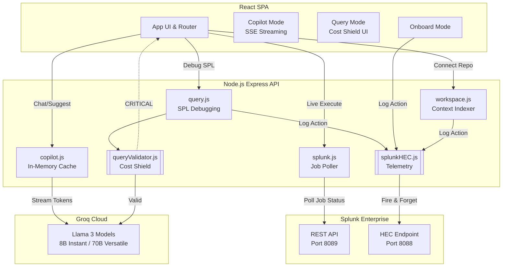

# Splunk Co>Dev — System Architecture Diagram 📊

This file contains the system architecture diagram for **Splunk Co>Dev**, illustrating the closed-loop flow between the React Frontend, Node.js/Express API Backend, Splunk Enterprise, and the Groq AI Cloud.

---

## 🎨 System Architecture (Mermaid)

---

## 🧱 Component Breakdown

1. **Frontend (React)**:
   * Provides the interactive interface. Features dedicated panels for Copilot chat streams, query validations, log onboarding, agent asset building, and DBA scan analytics.
2. **Backend (Express)**:
   * Hosts REST API routes to process requests. Handles static rule-based pre-validation for the Cost Shield and logs telemetric events asynchronously.
3. **External Splunk Enterprise**:
   * Runs local/cloud searches via REST Port `8089` and ingests developer metrics via HTTP Event Collector (HEC) on Port `8088`.
4. **AI Cloud (Groq)**:
   * Hosts high-speed Llama models that power SPL conversions, error debugging, and conversational assistance.
5. **Local Workspace**:
   * Writes compliant log field mappings dynamically to local `props.conf` files.
