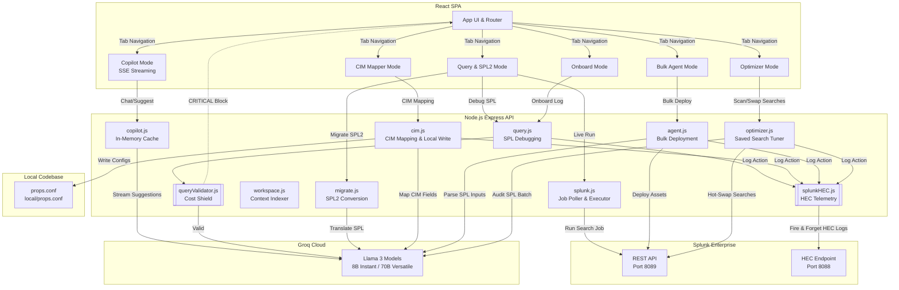

# Splunk Co>Dev — System Architecture Diagram 📊

This file contains the system architecture diagram for **Splunk Co>Dev**, illustrating the closed-loop flow between the React Frontend, Node.js/Express API Backend, Splunk Enterprise, and the Groq AI Cloud.

---

## 🎨 System Architecture (Mermaid)

---

## 🧱 Component Breakdown

1. **Frontend (React)**:
   * **Copilot Mode**: Real-time SSE streaming for interactive code/query assistance.
   * **Query & SPL2 Mode**: Raw SPL input debugger, live executor, and SPL1-to-SPL2 translation workspace.
   * **Onboard Mode**: Structured interface for onboarding new log data.
   * **Bulk Agent Mode**: Natural language interface to define, preview, and build dashboards, alerts, and reports.
   * **Optimizer Mode**: Audits existing saved searches, displaying inefficient patterns and offering 1-click hot-swaps.
   * **CIM Mapper Mode**: Raw log mapping to CIM schema with configuration output.

2. **Backend (Express)**:
   * **queryValidator.js**: Deterministic query parsing preventing wildcard searches and costly operations.
   * **cim.js**: Maps JSON/raw log structures to Splunk CIM standard properties and appends resulting `FIELDALIAS` configurations to the local workspace.
   * **agent.js**: Orchestrates natural language parsing into Simple XML Dashboards, Reports, and Alerts via REST APIs.
   * **optimizer.js**: Scans Splunk saved searches, identifies sub-optimal joins, transactions, or stats patterns, and queries the LLM to rewrite them into high-performance alternatives.
   * **splunkHEC.js**: Telemetry framework logging developer interactions to Splunk Enterprise via the HTTP Event Collector.

3. **External Splunk Enterprise**:
   * Runs local/cloud searches via REST Port `8089` and ingests developer metrics via HTTP Event Collector (HEC) on Port `8088`.

4. **AI Cloud (Groq)**:
   * Hosts high-speed Llama models that power SPL conversions, error debugging, and conversational assistance.

5. **Local Workspace**:
   * Writes compliant log field mappings dynamically to local `props.conf` files.

